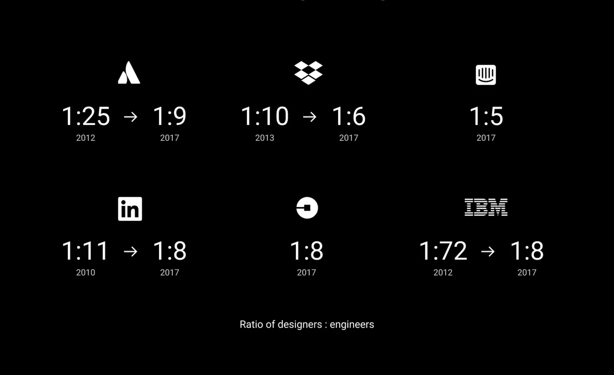

# 📱 Desarrollo de prototipos

El prototipado es una fase fundamental del desarrollo de un producto, ya sea una aplicación interactiva o de cualquier otra tipología.

Desarrollar un prototipo permite que diseñadores, programadores y usuarios se comuniquen entre ellos. Mediante su evaluación, se consigue obtener un compromiso entre la funcionalidad y la forma de interactuar.

Principalmente, durante el desarrollo de los prototipos, el diseñador se centra en dos aspectos claves para ofrecer una experiencia de usuario satisfactoria:

* **Legibilidad**: Cómo de sencillo es para un usuario interpretar la información ofrecida
* **Usabilidad**: Cómo de sencillo le resulta a un usuario el _descubrir_ las acciones que puede realizar

El rol del diseñador cobra cada vez más importancia dentro del mundo empresarial, como podemos ver en la siguiente imagen:

Como veremos a continuación, existen diferentes tipos de prototipos en lo que respecta a la fidelidad respecto al producto final. En el prototipo de la izquierda tenemos un prototipo de baja fidelidad, y en el de la derecha, uno de alta calidad:

{% embed url="https://www.figma.com/file/DaNtOwf5ZeWnKPy0SSuBls/lofi-hifi?node-id=0%3A1" %}
Fuente: [BYOL](https://bringyourownlaptop.com)

