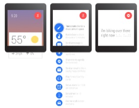
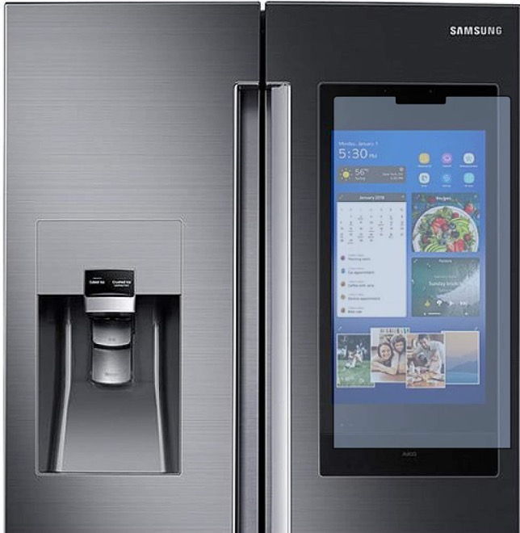

# 🤼‍♂️ Prototipado

Elige una de las siguientes propuestas

## **Propuesta 1**

Diseña un _wireframe_ lo más similar a la siguiente propuesta.

{% embed url="https://www.figma.com/file/7A1NodjwXognZeQW0dS9bA/Ej1-IPC-Wireframe?node-id=0%3A1" %}
Wireframe app mapas


## **Propuesta 2**

Diseña el _wireframe_ de la siguiente conocida aplicación de música. Deberás tener en cuenta los dos diseños posibles, móvil y tablet.

 

## **Propuesta 3**

Diseña un prototipo (baja o alta fidelidad) de una app despertador para un smartwatch, con el objetivo de facilitar su uso (establecer distintas alarmas, parar la alarma, desconectar la alarma, personalizar tonos, etc.).

## **Propuesta 4**

Diseña el prototipo (baja o alta fidelidad) de una interfaz de usuario orientada a un usuario mayor (e.g. una app para controlar la toma de medicamentos). Junto al diseño de dicho interfaz, describe brevemente las características más importantes de la interfaz orientadas a facilitar el uso del sistema.

## **Propuesta 5**

Diseña el prototipo (baja o alta fidelidad) de la interfaz de una app que se utilizará en la pantalla táctil de un frigorífico (tamaño tablet), en el que el usuario pueda crear un listado de productos que necesitas comprar, realizar un inventario de lo que tiene y realizar un pedido.

