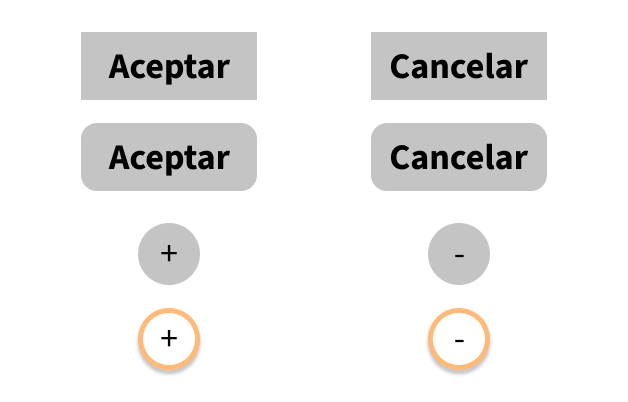

# Botones

Figma no soporta de manera natural la creación de botones como tal, no obstante, si combinamos textos con formas podemos simularlos:

Si el texto aparece detrás de la forma, puedes cambiar el orden en "Z" arrastrando los elementos dentro del frame:

 


Los elementos que aparecen más arriba ocultarán los que se encuentran más abajo.


