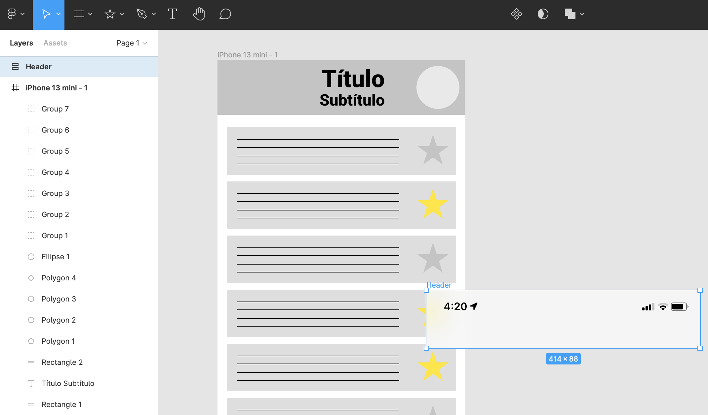

# Componentes

Para que nuestro prototipo sea más realista, podemos añadir ciertos elementos, como podría ser una barra de estado del sistema.

Es habitual que el equipo de diseñadores de una organización defina un _Design System_ o _Sistema de Diseño_, que no es más que un conjunto de elementos gráficos y guías de diseño que permiten definir es "estilo" de la organización:&#x20;

La comunidad de Figma ofrece una gran cantidad de elementos gráficos que podemos utilizar en nuestros prototipos:



En este caso, vamos a clonar el siguiente Design System:


Ahora, el botón no pone "Duplicate", sino "Open in Figma".



Parece ser que a día de hoy, Free UI Kit ha sido retirado, pero puedes utilizar cualquier _design system_ ofrecido en la plataforma.


{% embed url="https://www.figma.com/file/NiiNxjCVHziYIVMTjzMvOA/iOS-design-system-%E2%80%94-Free-UI-kit-(Community)?node-id=1%3A1590" %}
En la página "Templates" tenemos barras de estado


Podemos copiar un _frame_/grupo/elemento de un proyecto a otro (Ctrl+C / Ctrl+V), sin embargo, tras pegarlo, el elemento puede aparecer fuera del frame:

Agrupamos con Ctrl/Cmd + G y arrastramos dentro del frame. Deberemos modificar la distribución de elementos para que quede tal que así:

