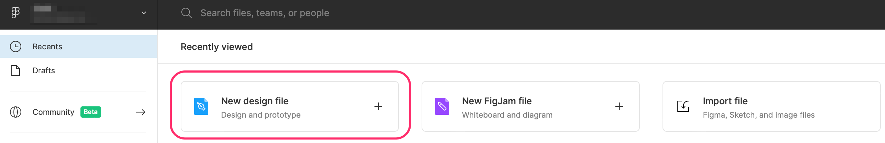
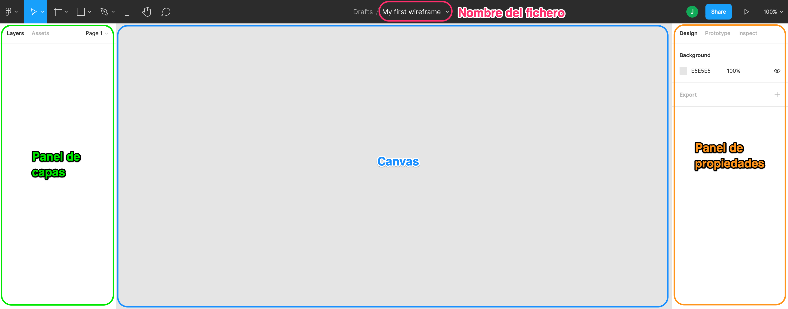

# Entorno

Una vez logeados en la plataforma, podremos crear un nuevo proyecto:

Una vez creado el proyecto/fichero de diseño, se nos abrirá la siguiente ventana:


Es importante que le demos un nombre a nuestro documento/proyecto, o acabaremos con múltiples proyectos con el nombre "Untitled" :disappointed\_relieved:


* **Canvas**: El lienzo donde arrastraremos los _frames_, imágenes, formas y textos que compondrán nuestro prototipo
* **Panel de capas**: En diseños más complejos, un prototipo estará compuesto por diferentes _frames_, que podrían identificar las diferentes pantallas del prototipo. Estos _frames_ aparecerán aquí
* **Panel de propiedades**: Cuando seleccionemos un elemento, podremos configurarlo desde aquí (e.g., Si seleccionamos un texto, la fuente, el tamaño, el color, el estilo...); no obstante, este panel tiene diferentes funcionalidades (_prototype_ e _inspect_) que veremos más adelante

### Frame

Un _frame_ es un contenedor de elementos, la zona definida donde arrastraremos los textos, imágenes y demás elementos. Puedes pensar en un frame como cada una de las pantallas de una aplicación; sin embargo, su funcionalidad va más allá que la de simular una pantalla, dado que pueden servir para agrupar elementos que aparecen en zonas concretas (e.g., un _frame_ para la cabecera, un _frame_ para el "footer", un _frame_ para el menú lateral...)

Para crear un _frame_, seleccionamos la herramienta de frames (tecla F) y seleccionamos un "preset":

Una vez hemos añadido el _frame_, vemos que en el panel de capas aparece el nuevo _frame_.


También es posible generar un _frame_ de cualquier dimensión si no elegimos ningún preset, clickamos y arrastramos.

Más tarde, desde el panel de propiedades, es posible modificar el tamaño del _frame_.


* Con **ratón**:
  * Click rueda + desplazamiento para movernos
  * Ctrl/Cmd + rueda de scroll para hacer zoom
* Con **trackpad**:
  * 2 dedos para movernos
  * Ctrl/Cmd + 2 dedos hacia arriba o abajo para hacer zoom

