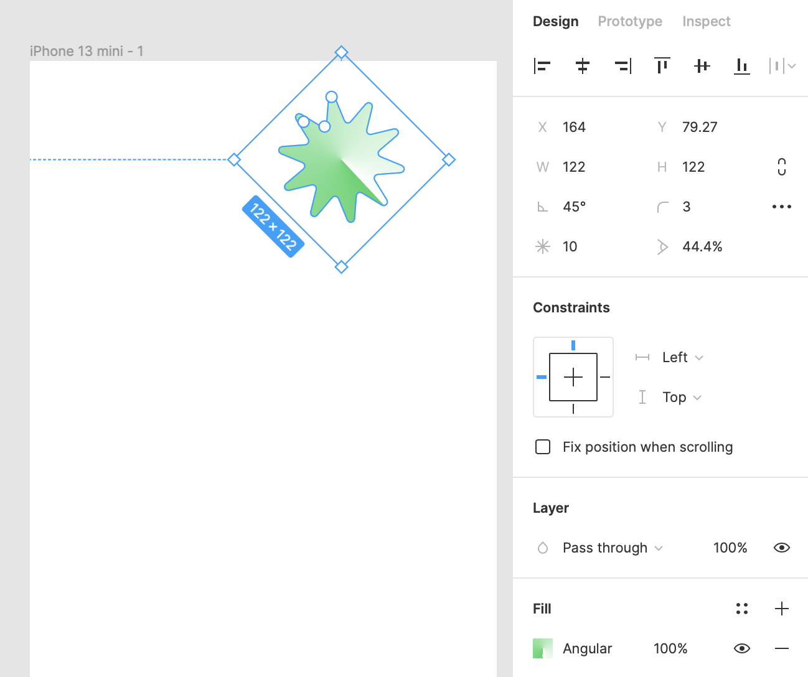
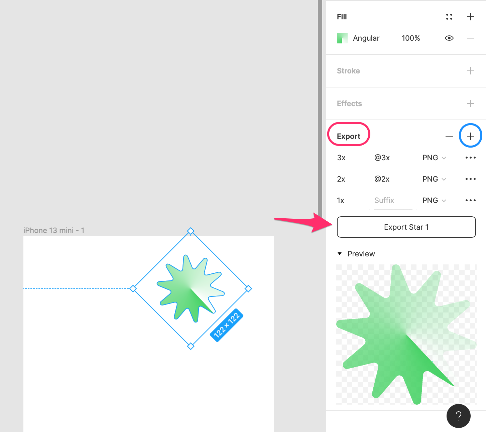

# Formas

Dado que el primer prototipo que realizaremos será un _wireframe_, necesitaremos generar formas que, en un futuro, deberían ser sustituidas por textos, imágenes o iconos.

Para crear una forma, seleccionamos la herramienta de forma, elegimos la forma que queramos generar y la "dibujamos" (click+drag) dentro del _frame_:

Independientemente de la forma que arrastremos, al seleccionarla, podremos modificar sus propiedades. En el ejemplo, hemos añadido un rectángulo, una elipse y una estrella:

Las siguientes propiedades suelen ser comunes a todos los elementos seleccionables:

* **Alignment**: Alineación de los elementos seleccionados; e.g., seleccionarlos todos y alinear sus centros de manera horizontal
* **x y**: Posición
* **w h**: Tamaño
* **Rotación**: En grados
* **Corner radius**: Permite definir esquinas redondeadas
* **Constraints**: Deberemos utilizarla si quisiéramos que un elemento quede anclado a un borde o se expanda conforme el tamaño del _frame_ varía (_responsiveness_)
* **Fill**: Relleno de la forma
* **Stroke**: Borde de la forma
* **Export**: Figma nos permite exportar los elementos como imágenes para facilitar el desarrollo

Finalmente, Figma permite exportar una misma imagen con diferentes tamaños. Esto es habitual cuando desarrollamos aplicaciones móviles, donde podemos encontrar dispositivos con diferentes resoluciones, y, según la resolución del mismo, la aplicación mostraría una imagen u otra:

Como las formas de Figma están vectorizadas, no tendremos problemas de "pixelación" al generar diferentes tamaños de la misma:

