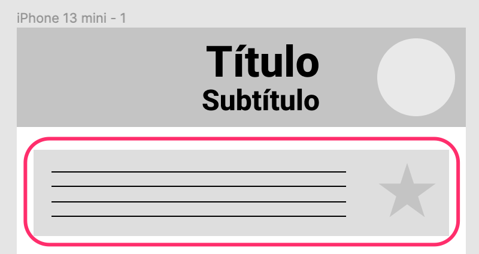
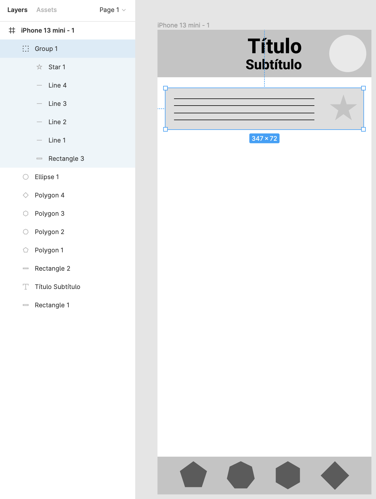

# Grupos

En ocasiones, queremos repetir ciertas distribuciones de elementos (e.g., una fila en una lista que hace scroll). Para ello, diseña el siguiente elemento:

Dado que queremos duplicar 6 elementos (la caja, la estrella y las 4 líneas), lo más conveniente es generar un grupo. Para ello, seleccionamos todos estos elementos y pulsamos Cmd/Ctrl + G:

Ahora, duplica unos cuantos para simular una aplicación con una lista:


Cmd/Ctrl + D repite la última acción, como por ejemplo, la duplicación y posicionado de un elemento.



En el desarrollo de _wireframes_ se ha de intentar minimizar el uso de colores al máximo. En este caso se utilizan diferentes tonalidades de grises para diferenciar entre forma y fondo, y el color amarillo de manera estratégica para indicar dos estados posibles.



También existe la posibilidad de generar un _frame_ (Cmd/Ctrl+Alt+G) en vez de un grupo (Cmd/Ctrl+G).

La funcionalidad es similar, pero generar un _frame_ ofrece características adicionales, como poder recortar el contenido que se salga del _frame_ (_Clip content_), o poder anclar elementos a los bordes del frame (_Constraints_).

