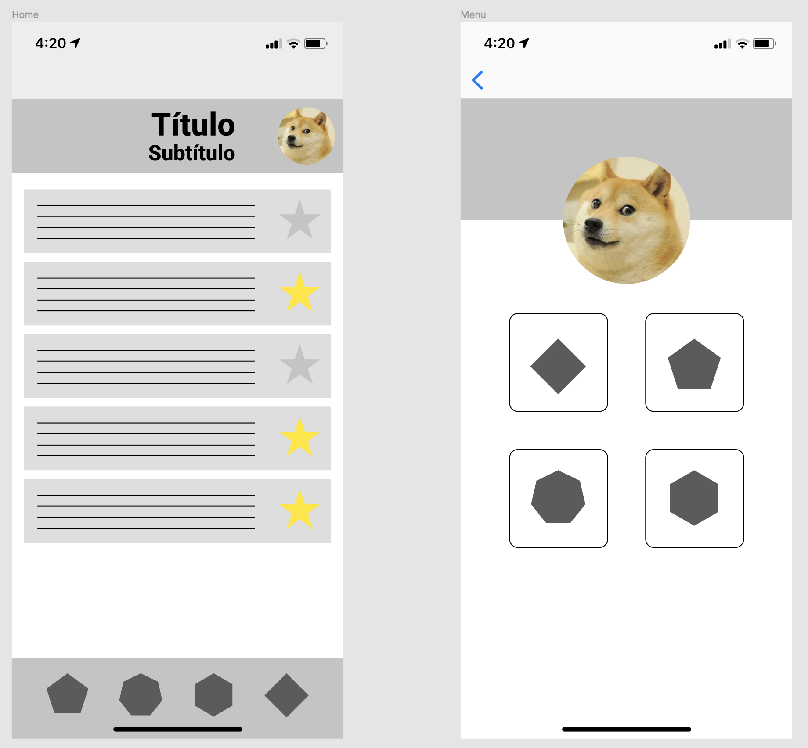

# Imágenes

Vamos a añadir una imagen para dar un poco más de personalidad a nuestro prototipo. Para ello, en la herramienta de creación de forma aparece la opción "Place image..."

A continuación, vamos a buscar una imagen de avatar que creamos conveniente, la seleccionamos tras pulsar en "Place image..." y clickamos en las formas donde queramos poner la imagen (la propiedad Fill se actualizará automáticamente):


También puedes usar el atajo Mayus + Cmd/Ctrl + K para añadir una imagen.

