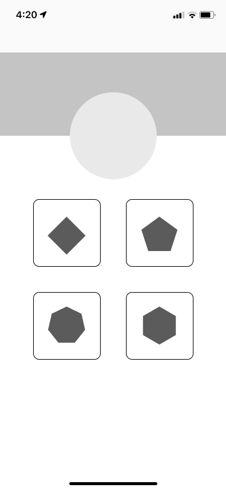
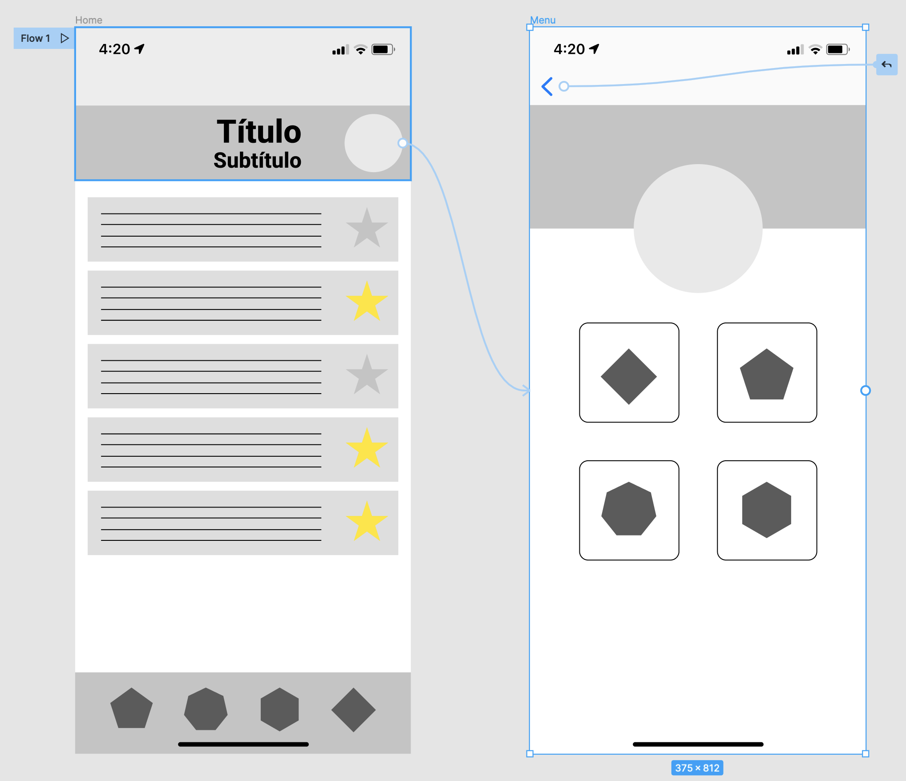
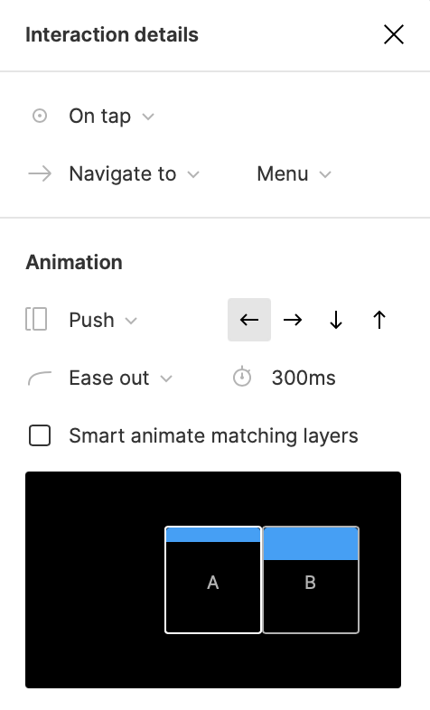

# Navegación

Habitualmente, una aplicación está compuesta por distintas pantallas, dado que puede resultar interesante distribuir la información de manera que el usuario no se sienta agobiado. En Figma utilizamos los _frames_ para lograr este objetivo.

En el ejercicio que estamos desarrollando ya hemos creado un _frame_. A continuación, crearemos otro (tecla F) del mismo tipo que el primero (iPhone 13 mini) junto a la barra de navegación superior y el botón flotante inferior:

Como puedes observar, hemos renombrado los _frames_ para identificar cada una de las pantallas de la aplicación.

Dado que vamos a prototipar un menú, el siguiente paso es que generes la siguiente pantalla en el _frame_ "Menu":

Imagina que queremos navegar del frame "Home" a "Menu" cuando el usuario pulse sobre el icono del perfil del usuario. Figma permite desarrollar prototipos interactivos para que usuarios y desarrolladores puedan entender cuál sería el flujo de navegación de la aplicación.

Para ello, seleccionamos el icono del perfil, abrimos la pestaña _Prototype_ (con algún elemento seleccionado!) en el panel de propiedades y añadimos una interacción:


Para generar transiciones con mayor facilidad, podemos arrastrar desde el círculo que aparece al seleccionar un elemento.


También resultaría interesante poder navegar hacia atrás. En este ejercicio, añade una flecha en la barra de navegación del frame "Menu" y genera una interacción para volver al frame anterior (acción "Back"):

### Animación de la transición

También es posible animar la transición para que no sea tan seca. Para ello, seleccionamos la línea de la transición y, en el panel emergente, podremos seleccionar la animación que queramos:

La animación de "push" es bastante adecuada para este caso, ya que desplaza la ventana actual hacia un lado, como si se estuvieran "apilando" las ventanas.

A la hora de ejecutar el prototipo interactivo, Figma deshará esa animación de la forma que esperamos.
