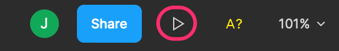

# Prototipo interactivo

Figma soporta la emulación de un prototipo interactivo de forma que tanto usuario como desarrolladores puedan tener una idea de cómo es la navegación en la aplicación.

Para ello, pulsamos en el botón "Present" que encontraremos en la parte derecha de la barra superior.&#x20;

Esto nos abrirá una nueva ventana del navegador con el prototipo interactivo.

 

Al pulsar sobre los elementos en los que hemos creado las transiciones, Figma simulará la transición entre pantallas.
