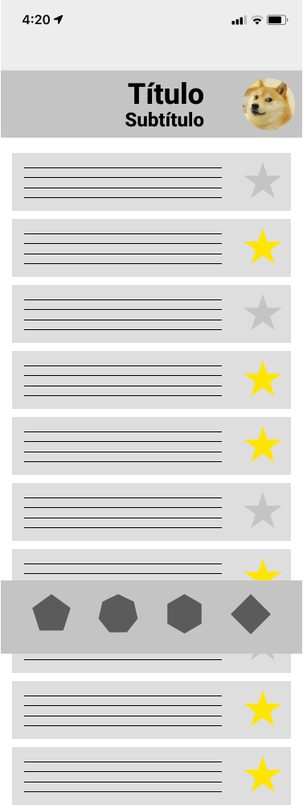

# Scroll

¿Qué ocurre si el contenido que queremos representar no cabe en todo el frame?

En primer lugar, debemos especificar el orden de profundidad de los elementos, ya que podemos observar que existe un problema de solapamiento. Para ello, podemos modificar el orden en "Z" haciendo click derecho sobre el elemento y seleccionando "Bring to front" o "Send to back":

Ahora, seleccionamos todo el frame "Home" y en el panel _Prototype_ modificamos la opción de _Overflow scrolling_:

Sin embargo, si ejecutamos el prototipo interactivo, todo el contenido se desplazará. Por ello, debemos especificar qué elementos se ven afectados por el scroll y cuáles no. Por ello, es conveniente generar grupos.


Esta propiedad de fijar la posición del elemento frente a un scroll se ha movido al menú Prototype 


Deberás aplicar esta opción a los siguientes elementos:

* Barra de estado
* Barra inferior
* Menú home flotante

