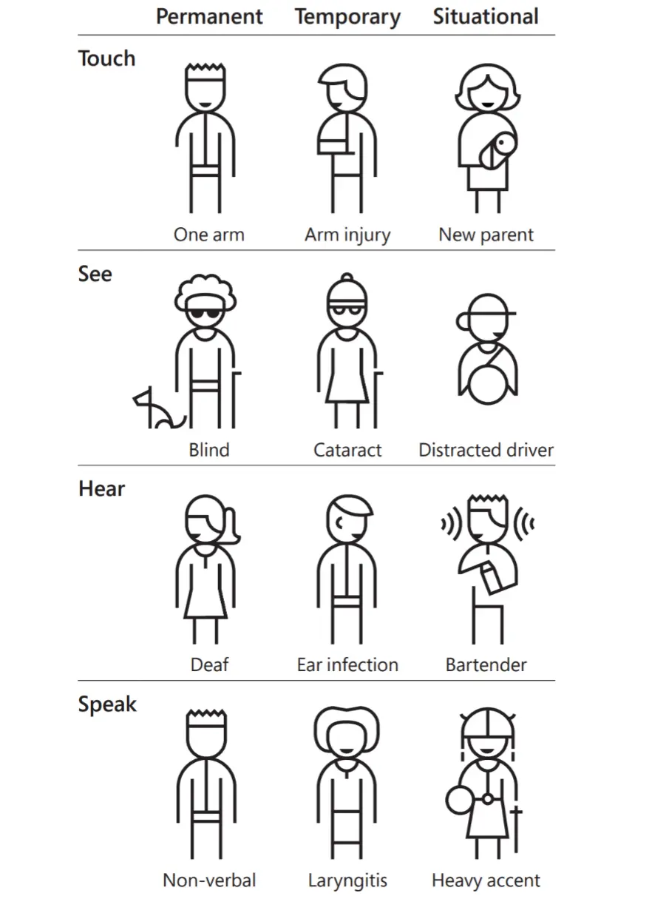
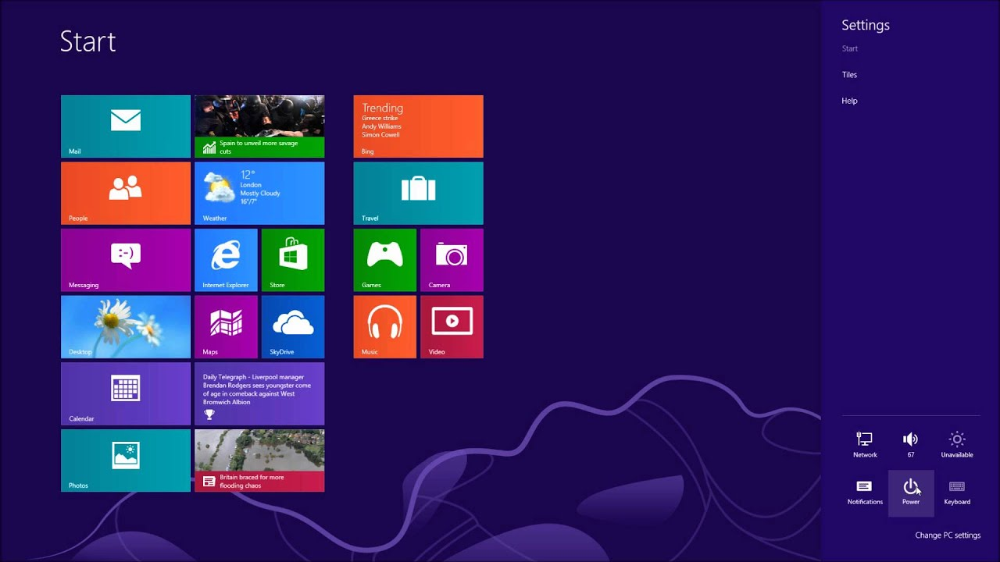

# Accesibilidad y usabilidad

Figma es una herramienta que nos permitirá desarrollar prototipos a distintos niveles de fidelidad; no obstante, es interesante que nos preguntemos ciertas cosas **antes** y **durante** el proceso de diseño:

1. Audiencia de la aplicación
2. Aspectos de accesibilidad
3. Aspectos de usabilidad

