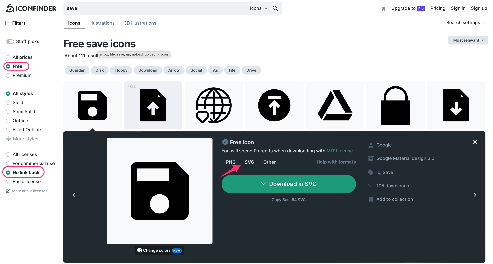

# Dónde encontrar iconos e imágenes

### Iconos

* [Flaticon](https://www.flaticon.com)
* [Iconfinder](https://www.iconfinder.com)
* [Icomoon](https://icomoon.io/)
* Figma Community -> Icons ([link](https://www.figma.com/community/icons))


El formato .svg es un formato vectorial, por lo tanto, siempre se verá bien independientemente del tamaño de la imagen.

En Figma, al importar un .svg se importará como un Frame, a partir del cual podremos extraer la forma vectorial sin ningún problema.

Otra ventaja del formato .svg en Figma es la posibilidad de cambiar el color del icono.


### Imágenes

* [Pexels](https://www.pexels.com/)
* [Pixabay](https://pixabay.com/)
